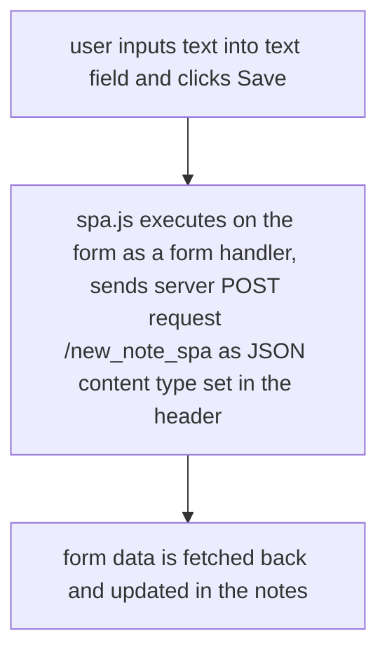

```mermaid
graph TD;
    A[user inputs text into text field and clicks Save] --> B[spa.js executes on the form as a form handler, sends server POST request 
/new_note_spa as JSON content type set in the header] --> C[form data is fetched back and updated in the notes]
```