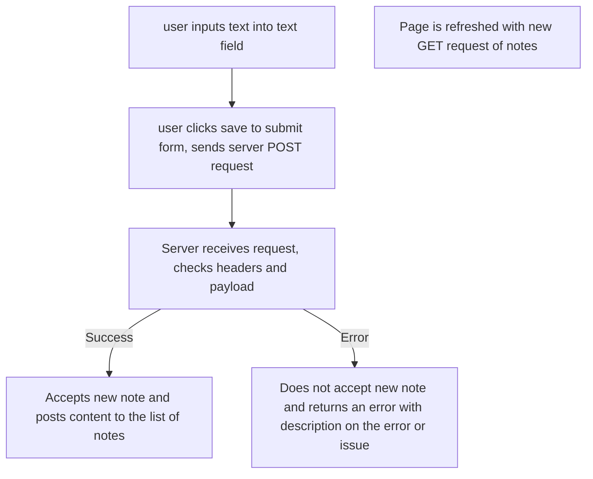

```mermaid
graph TD;
    A[user inputs text into text field] --> B[user clicks save to submit form, sends server POST request] --> C[Server receives request, checks headers and payload]

    C -- Success --> D[Accepts new note and posts content to the list of notes]
    C -- Error --> E[Does not accept new note and returns an error with description on the error or issue]

    F[Page is refreshed with new GET request of notes]
```