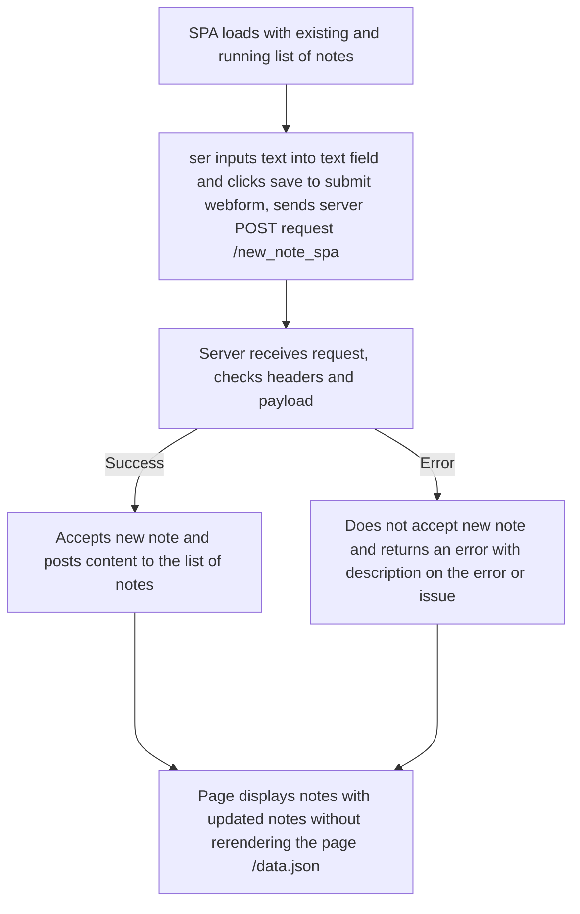

```mermaid
graph TD;
    A[SPA loads with existing and running list of notes] --> B[ser inputs text into text field and clicks save to submit webform, sends server POST request 
/new_note_spa] --> C[Server receives request, checks headers and payload]

    C -- Success --> D[Accepts new note and posts content to the list of notes]
    C -- Error --> E[Does not accept new note and returns an error with description on the error or issue]

    D ----> F[Page displays notes with updated notes without rerendering the page /data.json]
    E ----> F[Page displays notes with updated notes without rerendering the page /data.json]
```